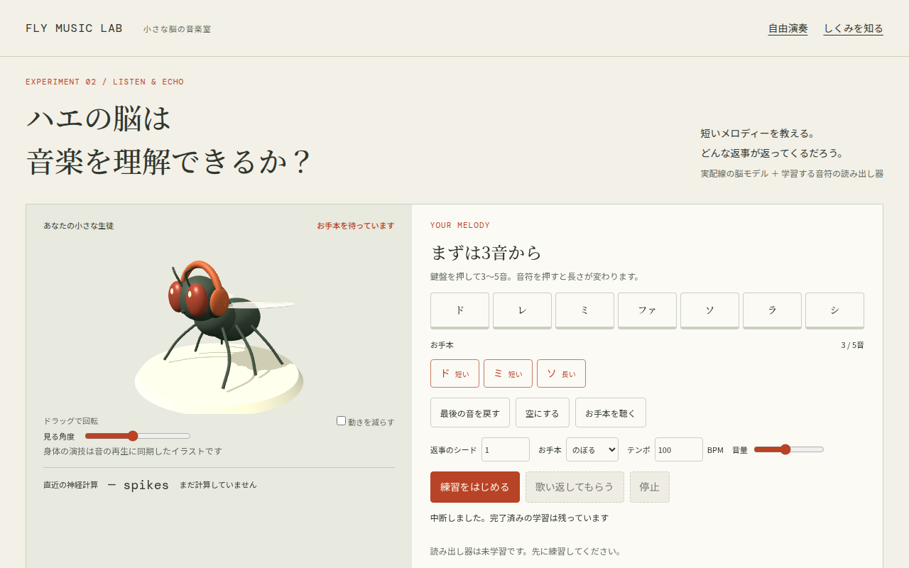
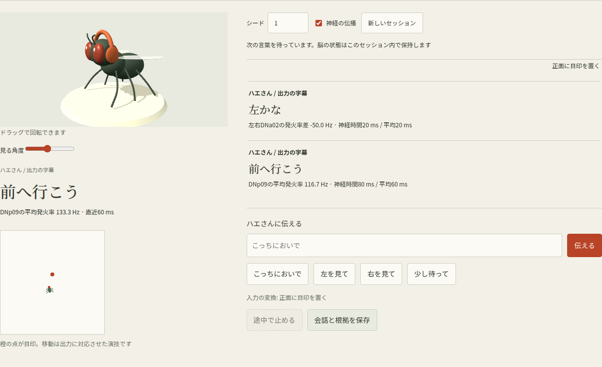
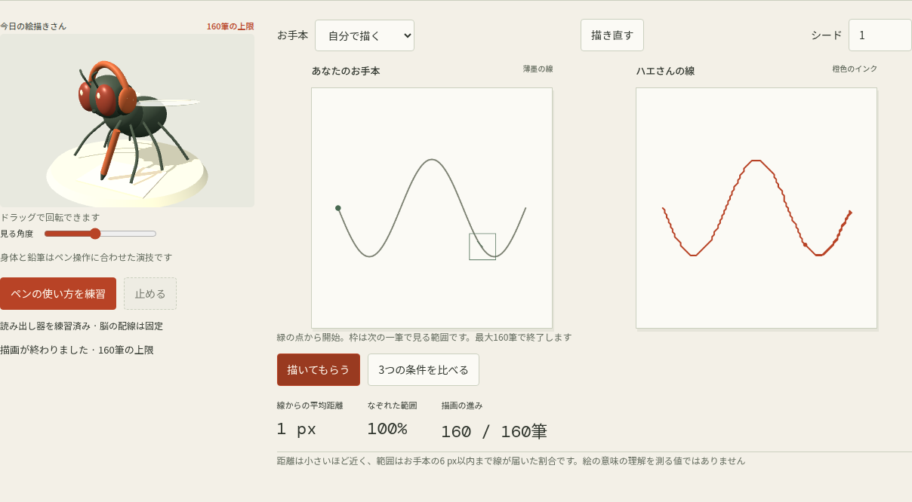

# Fly Music Lab

「ハエの脳は音楽を理解できるか？」をテーマに、短いメロディーを入力して歌い返せるかを調べる日本語のローカルアプリです。ヘッドフォンをつけた3Dのハエと、お手本・返事の音符比較を使って実験できます。

お絵かき実験も追加しました。`/draw.html` で、丸・三角・波線や自作線を見せて、鉛筆を持つ3Dハエのなぞり描きを試せます。[お絵かきの実習ガイド](docs/drawing-guide.md) に操作と仕組みをまとめています。

まずは [メロディー実験の実習ガイド](docs/echo-guide.md) を読んでください。以前の自由演奏は `/free.html` に残っています。



## 起動

Node.js 22以降、Python 3、PC版Chromeを推奨。Three.jsの依存を固定版でインストールします。

```sh
git clone https://github.com/HirokiMorimoto0713/fly-music-lab.git
cd fly-music-lab
npm ci --ignore-scripts
npm run prepare:data
npm start
```

ブラウザで http://127.0.0.1:4389 を開きます。配線データが準備済みなら `npm start` だけで使えます。ポートは `PORT=4390 npm start` のように変更できます。

Macから母艦にSSHする場合、Macのターミナルで以下を実行し、Macのブラウザで http://127.0.0.1:14389 を開きます。母艦へログイン済みのターミナルではなく、Mac側の新しいタブで実行してください。`母艦のSSH接続先` は普段接続に使っているホスト名に置き換えてください。

```sh
ssh -N -L 14389:127.0.0.1:4389 motoha@母艦のSSH接続先
```

サーバーは127.0.0.1にのみ接続します。ローカルアプリとして構築しており、公開サービスへのデプロイはしていません。ブラウザには全配線を展開するため数百MB以上の空きメモリが必要です。データ取得時以外の実験計算・音声合成・保存はブラウザ内で実行します。Google Fontsが利用できない場合は端末のフォントへフォールバックします。

## メロディー実験

- 3〜5音のお手本作成、音程と長さの比較、試聴
- 固定の実配線LIFの入力後状態から、追加の線形読み出し器で返事を推定
- シード変更・未学習曲・伝播なし・状態リセットの比較
- 学習ノートの保存・復元、返事のMIDI/WAV・実験JSON
- 実際の発火を細胞体位置に重ねた反応図、音ごとの区間選択、PNG保存
- ヘッドフォンをつけたThree.jsの3Dハエ（動きは再生に合わせた演技）

## ハエさんと話す



`/talk.html`、Macの既存トンネルでは `http://127.0.0.1:14389/talk.html` を開きます。「こっちにおいで」「左 / 右を見て」「少し待って」を目印へ変換し、全配線の神経出力から「前へ行こう」「右かな」「……」という字幕を出します。

送信間の状態保持、字幕の根拠となる発火率、脳反応図、伝播なしの対照、会話と根拠のJSON保存に対応。言葉の解釈と字幕の閾値は人工的な規則で、主観や自然な言語理解の推定ではありません。[会話のガイド](docs/talk-guide.md) で仕組みを確認できます。

## お絵かき実験



- 局所的な線の観測 → 人工視覚入力 → 全配線LIF → 学習したペン操作の閉ループ
- プリセットと自作の一筆線、描線の距離となぞれた範囲、シード変更と対照比較
- 鉛筆を持つ3Dハエ、一筆ごとの視野と脳反応図
- 完成した描線のPNG、実験JSON、学習ノートの保存と復元

学習するのは追加の読み出し器で、自然な視覚や作画能力を再現したという主張ではありません。描画の成績と限界は [検証記録](docs/verification.md) を参照してください。

## 自由演奏でできること

- 166,700神経・25,582,938接続を使ったLIFの実計算
- 名前の付いた神経への刺激、発火の可視化、音楽と身体への変換
- 同じ条件の再実行、伝播あり／なしの比較
- WAV、MIDI、実験JSONのダウンロード
- ブラウザに最新5実験の条件を保存し、再実行
- [実習ガイド](docs/guide.md)、[モデルの仮定と出典](docs/model.md)

## 実装

ES modules、Web Worker、Web Audio、Three.js、Canvas、Nodeの静的サーバー。ビルド処理、APIキー、AIモデルAPI、DBは不要です。全神経をCPUで計算し、本文や生成データを外部サービスへ送信しません。

メロディー実験の計算は `src/echo-model.js`、画面操作は `src/echo-ui.js`、3Dは `src/fly3d.js`。自由演奏の変換は `src/mapping.js`。共通のLIF実装は `vendor/brain.js` です。最初に読むなら実習ガイドから進めてください。

## 検証

```sh
npm test
```

実データの準備が必須です。全配線、再現性、伝播対照、無刺激、JSON検証、WAV/MIDI形式を確認します。ブラウザE2Eは `tests/browser.mjs` を参照してください。

## 出典とライセンス

データ: MaleCNS collaboration（FlyEM / HHMI Janelia、University of Cambridge、MRC LMB、Google Research）、CC BY 4.0。圧縮配列とLIF実装は [Xenova](https://huggingface.co/spaces/Xenova/fruit-fly-simulation) の固定版から。上流のライセンスは `vendor/LICENSE`、取得したファイルのハッシュは `public/data/provenance.json` にあります。配布元データの選別方法や簡略化はモデル文書を参照してください。

メロディー実験で学習するのは追加の線形読み出し器です。神経配線は固定で、ハエ自身の学習、意識の再現、検証済みの生物学的エミュレーションを示すものではありません。音楽・身体への変換は創作上のルールで、保存操作は学習ではありません。

3Dライブラリ: Three.js 0.186.0 / MIT（`node_modules/three/LICENSE`）。3Dのハエとヘッドフォンは独自の形状です。
